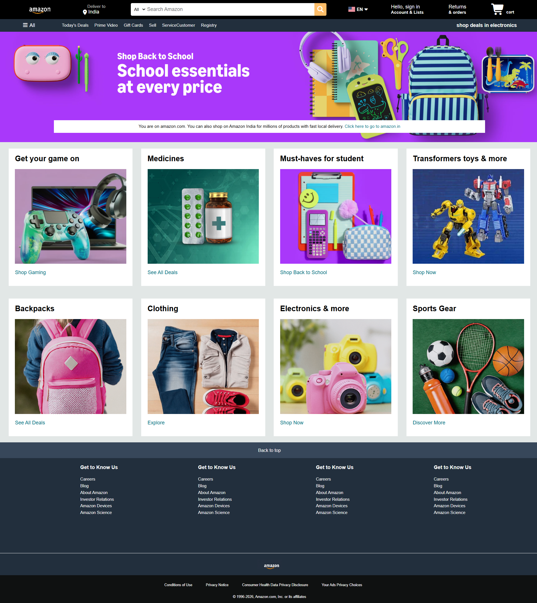
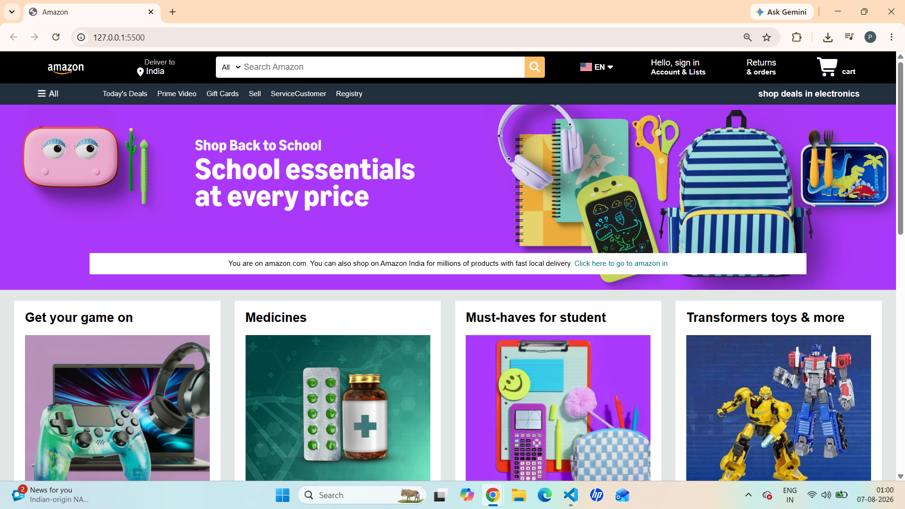
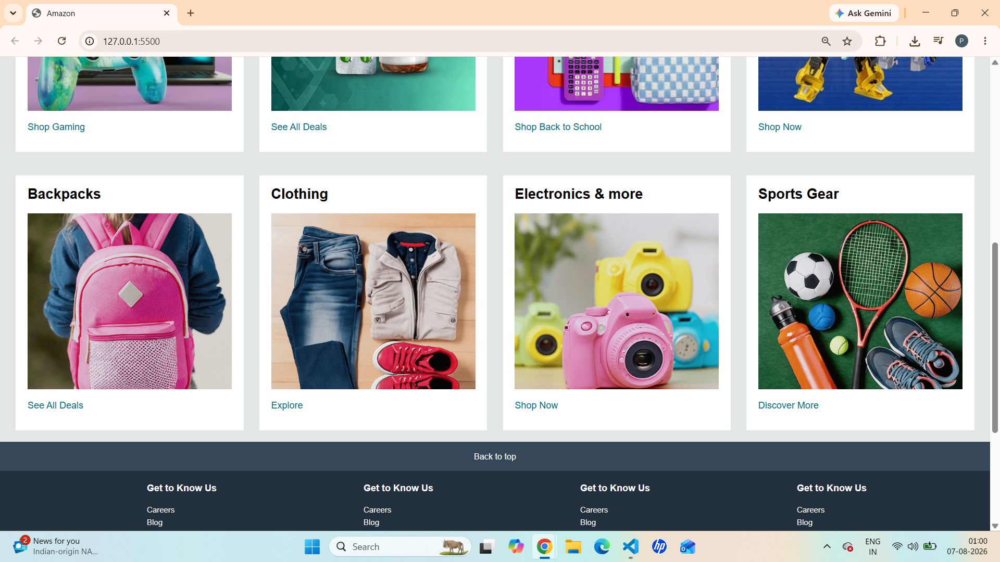
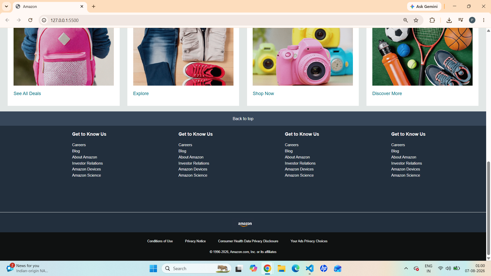

# amazon-homepage-clone

A responsive front-end clone of the Amazon homepage built using **HTML5** and **CSS3**. This project was created to strengthen my understanding of modern web development fundamentals, responsive layouts, and UI design by recreating one of the world's most popular e-commerce websites.

---

📸 Screenshots

## Homepage



## Navbar



## Product Cards



## Footer




---

## 🚀 Live Demo

🔗 https://your-live-demo-link.netlify.app

---

## ✨ Features

- Amazon-inspired responsive homepage
- Fully structured navigation bar
- Search bar with category selector
- Language selector UI
- Hero banner section
- Product recommendation cards
- Multi-column footer
- Hover effects
- Clean and organized layout
- Semantic HTML5 structure
- Flexbox-based layout

---

## 🛠️ Technologies Used

- HTML5
- CSS3
- Flexbox
- Google Fonts

---

## 📚 What I Learned

While building this project, I gained practical experience with:

- Semantic HTML
- CSS Flexbox
- Positioning
- Box Model
- Responsive layouts
- CSS hover effects
- Recreating real-world website interfaces
- Organizing frontend project structure

---

## 📈 Future Improvements

- Add JavaScript functionality
- Functional search bar
- Language dropdown menu
- Shopping cart interactions
- Mobile responsiveness
- Dark mode
- Product carousel
- Backend integration

---

## 💻 Getting Started

Clone the repository

```bash
git clone https://github.com/yourusername/amazon-homepage-clone.git
